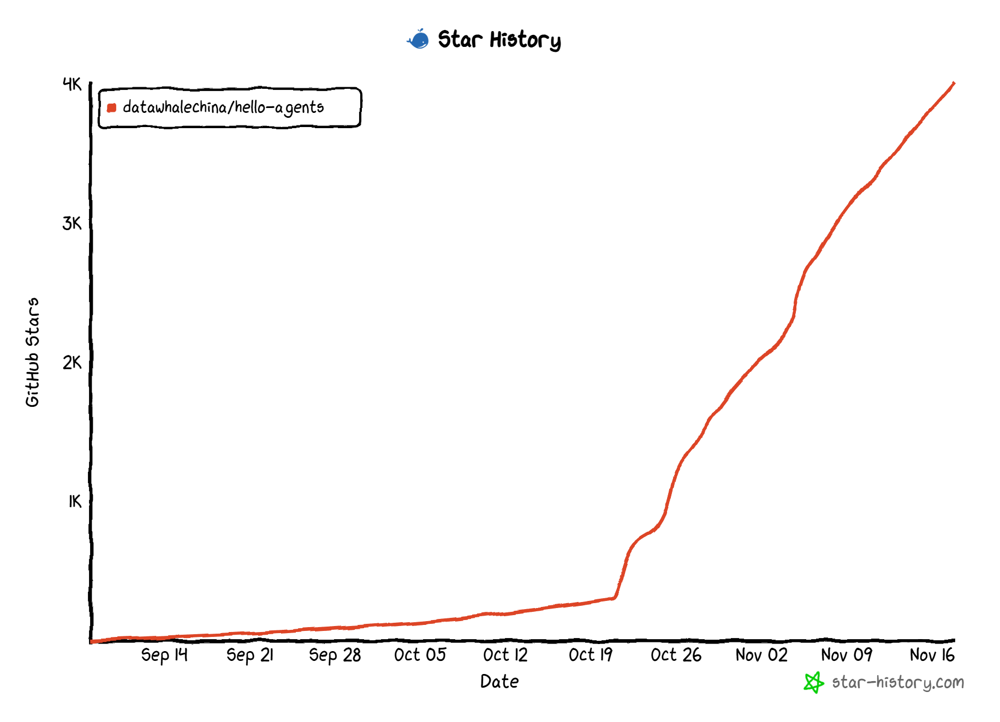

  English | <a href="./README.md">中文</a>

  
  <h1>Hello-Agents</h1>
  <h3>🤖 "Building Agent Systems from Scratch"</h3>
  
<em>From foundational theory to practical applications, master the design and implementation of agent systems</em>

  
  
  
  
  

---

## 🎯 Project Introduction

&emsp;&emsp;If 2024 was the year of the "Battle of a Hundred Models," then 2025 has undoubtedly ushered in the "Year of Agents." The focus of technology is shifting from training larger foundation models to building smarter agent applications. However, systematic, practice-oriented tutorials are extremely scarce. For this reason, we launched the Hello-Agents project, hoping to provide the community with a comprehensive guide to building agent systems from scratch, balancing theory and practice.

&emsp;&emsp;Hello-Agents is a **systematic agent learning tutorial** from the Datawhale community. Today, agent development is mainly divided into two schools: one is software engineering-oriented agents like Dify, Coze, and n8n, which are essentially process-driven software development with LLMs serving as data processing backends; the other is AI-native agents, truly AI-driven agents. This tutorial aims to lead you to deeply understand and build the latter—truly AI Native Agents. The tutorial will guide you through the surface of frameworks, starting from the core principles of agents, delving into their core architecture, understanding their classic paradigms, and ultimately building your own multi-agent applications. We believe that the best way to learn is through hands-on practice. We hope this tutorial can be your starting point for exploring the world of agents, transforming you from a "user" of large language models to a "builder" of agent systems.

## 📚 Quick Start

### Online Reading
**[🌐 Click here to start reading online](https://datawhalechina.github.io/hello-agents/)** - No download required, learn anytime, anywhere

**[📖 Cookbook (Beta)](https://book.heterocat.com.cn/)**

### Local Reading
If you wish to read locally or contribute content, please refer to the learning guide below.

### ✨ What Will You Gain?

- 📖 **Datawhale Open Source & Free** - Learn all project content completely free, grow with the community
- 🔍 **Understand Core Principles** - Deeply understand agent concepts, history, and classic paradigms
- 🏗️ **Hands-on Implementation** - Master popular low-code platforms and agent code frameworks
- 🛠️ **Self-developed Framework [HelloAgents](https://github.com/jjyaoao/helloagents)** - Build your own agent framework from scratch based on OpenAI native API
- ⚙️ **Master Advanced Skills** - Step-by-step implementation of context engineering, Memory, protocols, evaluation, and other systematic technologies
- 🤝 **Model Training** - Master Agentic RL, from SFT to GRPO full-process practical LLM training
- 🚀 **Drive Real Cases** - Practical development of intelligent travel assistants, cyber towns, and other comprehensive projects
- 📖 **Job Interviews** - Learn agent-related interview questions for job hunting

## 📖 Content Navigation

| Chapter | Key Content | Status |
| --- | --- | --- |
| [Preface](./docs/Preface.md) | Project origin, background, and reader suggestions | ✅ |
| **Part 1: Agent and Language Model Fundamentals** |  |  |
| [Chapter 1: Introduction to Agents](./docs/chapter1/Chapter1-Introduction-to-Agents.md) | Agent definition, types, paradigms, and applications | ✅ |
| [Chapter 2: History of Agents](./docs/chapter2/Chapter2-History-of-Agents.md) | Evolution from symbolism to LLM-driven agents | ✅ |
| [Chapter 3: Large Language Model Fundamentals](./docs/chapter3/Chapter3-Fundamentals-of-Large-Language-Models.md) | Transformer, prompts, mainstream LLMs and their limitations | ✅ |
| **Part 2: Building Your LLM Agent** |  |  |
| [Chapter 4: Classic Agent Paradigm Construction](./docs/chapter4/Chapter4-Building-Classic-Agent-Paradigms.md) | Hands-on implementation of ReAct, Plan-and-Solve, Reflection | ✅ |
| [Chapter 5: Low-Code Platform Agent Development](./docs/chapter5/Chapter5-Building-Agents-with-Low-Code-Platforms.md) | Understanding Coze, Dify, n8n and other low-code agent platforms | ✅ |
| [Chapter 6: Framework Development Practice](./docs/chapter6/Chapter6-Framework-Development-Practice.md) | AutoGen, AgentScope, LangGraph and other mainstream framework applications | ✅ |
| [Chapter 7: Building Your Agent Framework](./docs/chapter7/Chapter7-Building-Your-Agent-Framework.md) | Building an agent framework from scratch | ✅ |
| **Part 3: Advanced Knowledge Extension** |  |  |
| [Chapter 8: Memory and Retrieval](./docs/chapter8/Chapter8-Memory-and-Retrieval.md) | Memory systems, RAG, storage | ✅ |
| [Chapter 9: Context Engineering](./docs/chapter9/Chapter9-Context-Engineering.md) | "Contextual understanding" for continuous interaction | ✅ |
| [Chapter 10: Agent Communication Protocols](./docs/chapter10/Chapter10-Agent-Communication-Protocols.md) | MCP, A2A, ANP and other protocol analysis | ✅ |
| [Chapter 11: Agentic-RL](./docs/chapter11/Chapter11-Agentic-RL.md) | Practical LLM training from SFT to GRPO | ✅ |
| [Chapter 12: Agent Performance Evaluation](./docs/chapter12/Chapter12-Agent-Performance-Evaluation.md) | Core metrics, benchmarks, and evaluation frameworks | ✅ |
| **Part 4: Comprehensive Case Studies** |  |  |
| [Chapter 13: Intelligent Travel Assistant](./docs/chapter13/Chapter13-Intelligent-Travel-Assistant.md) | Real-world applications of MCP and multi-agent collaboration | ✅ |
| [Chapter 14: Automated Deep Research Agent](./docs/chapter14/Chapter14-Automated-Deep-Research-Agent.md) | DeepResearch Agent reproduction and analysis | ✅ |
| [Chapter 15: Building a Cyber Town](./docs/chapter15/Chapter15-Building-Cyber-Town.md) | Combining agents with games, simulating social dynamics | ✅ |
| **Part 5: Capstone Project and Future Outlook** |  |  |
| [Chapter 16: Capstone Project](./docs/chapter16/Chapter16-Graduation-Project.md) | Build your own complete multi-agent application | ✅ |

### Community Contributions

&emsp;&emsp;We welcome everyone to contribute their unique insights and practical summaries from learning Hello-Agents or Agent-related technologies to the community selection in the form of PRs. If the content is independent of the main text, you can also submit it to Extra-Chapter! **Looking forward to your first contribution!**

| Community Selection | Content Summary |
| --- | --- |
| [01-Agent Interview Questions Summary](https://github.com/datawhalechina/hello-agents/blob/main/Extra-Chapter/Extra01-面试问题总结.md) | Agent position-related interview questions |
| [01-Agent Interview Answers](https://github.com/datawhalechina/hello-agents/blob/main/Extra-Chapter/Extra01-参考答案.md) | Answers to related interview questions |
| [02-Context Engineering Content Supplement](https://github.com/datawhalechina/hello-agents/blob/main/Extra-Chapter/Extra02-上下文工程补充知识.md) | Context engineering content extension |
| [03-Dify Agent Creation Step-by-Step Tutorial](https://github.com/datawhalechina/hello-agents/blob/main/Extra-Chapter/Extra03-Dify智能体创建保姆级操作流程.md) | Dify Agent Creation Step-by-Step Tutorial |

### PDF Version Download

&emsp;&emsp;*<strong>This Hello-Agents PDF tutorial is completely open source and free. To prevent various marketing accounts from adding watermarks and selling it to multi-agent system beginners, we have pre-added a Datawhale open source logo watermark that does not affect reading in the PDF file. Please understand~</strong>*

> *Hello-Agents PDF: https://github.com/datawhalechina/hello-agents/releases/tag/V1.0.0*  
> *Hello-Agents PDF Domestic Download: https://www.datawhale.cn/learn/summary/239* 

## 💡 How to Learn

&emsp;&emsp;Welcome, future builder of intelligent systems! Before embarking on this exciting journey, please allow us to give you some clear guidance.

&emsp;&emsp;This project balances theory and practice, aiming to help you systematically master the entire process of designing and developing from single agents to multi-agent systems. Therefore, it is especially suitable for **AI developers, software engineers, students** with some programming foundation, as well as **self-learners** with a strong interest in cutting-edge AI technology. Before learning this project, we hope you have basic Python programming skills and a basic conceptual understanding of large language models (for example, knowing how to call an LLM through an API). The focus of the project is on application and construction, so you do not need a deep background in algorithms or model training.

&emsp;&emsp;The project is divided into five major parts, each being a solid step towards the next stage:

- **Part 1: Agent and Language Model Fundamentals** (Chapters 1-3), we will start from the definition, types, and development history of agents, sorting out the ins and outs of the concept of "agents." Then, we will quickly consolidate the core knowledge of large language models, laying a solid theoretical foundation for your practical journey.

- **Part 2: Building Your LLM Agent** (Chapters 4-7), this is the starting point of your hands-on practice. You will personally implement classic paradigms such as ReAct, experience the convenience of low-code platforms like Coze, and master the application of mainstream frameworks like Langgraph. Finally, we will also guide you to build your own agent framework from scratch, giving you the ability to both "use wheels" and "build wheels."

- **Part 3: Advanced Knowledge Extension** (Chapters 8-12), in this part, your agent will "learn" to think and collaborate. We will use the self-developed framework from Part 2 to deeply explore core technologies such as memory and retrieval, context engineering, and Agent training, and learn communication protocols between multi-agents. Finally, you will master professional methods for evaluating agent system performance.

- **Part 4: Comprehensive Case Studies** (Chapters 13-15), this is the intersection of theory and practice. You will integrate what you have learned and personally create intelligent travel assistants, automated deep research agents, and even a cyber town that simulates social dynamics, tempering your construction ability in real and interesting projects.

- **Part 5: Capstone Project and Future Outlook** (Chapter 16), at the end of the journey, you will face a capstone project, building a complete multi-agent application of your own, comprehensively testing your learning outcomes. We will also look forward to the future of agents with you, exploring exciting frontier directions.

&emsp;&emsp;Agents are a rapidly developing field that is extremely dependent on practice. To achieve the best learning effect, we provide all supporting code in the project's `code` folder. We strongly recommend that you **combine theory with practice**. Please be sure to personally run, debug, and even modify every piece of code provided in the project. You are welcome to follow Datawhale and other Agent-related communities at any time. When you encounter problems, you can ask questions in the issue area of this project at any time.

&emsp;&emsp;Now, are you ready to enter the wonderful world of agents? Let's start right away!

## 🤝 How to Contribute

We are an open-source community and welcome any form of contribution!

- 🐛 **Report Bugs** - Found content or code issues, please submit an Issue
- 💡 **Make Suggestions** - Have good ideas for the project, welcome to initiate discussions
- 📝 **Improve Content** - Help improve the tutorial, submit your Pull Request
- ✍️ **Share Practice** - Share your learning notes and projects in "Community Contributions"

## 🙏 Acknowledgments

### Core Contributors
- [Chen Sizhou - Project Lead](https://github.com/jjyaoao) (Datawhale member, full text writing and proofreading)
- [Sun Tao - Project Lead](https://github.com/fengju0213) (Datawhale member, Chapter 9 content and proofreading)
- [Jiang Shufan - Project Lead](https://github.com/Tsumugii24) (Datawhale member, chapter exercise design and proofreading)
- [Huang Peilin - Datawhale Prospective Member](https://github.com/HeteroCat) (Agent Development Engineer, Chapter 5 content contributor)
- [Zeng Xinmin - Agent Engineer](https://github.com/fancyboi999) (Niuke Technology, Chapter 14 case development)
- [Zhu Xinzhong - Advisory Expert](https://xinzhongzhu.github.io/) (Chief Scientist of Datawhale, Professor at Hangzhou Institute of Artificial Intelligence, Zhejiang Normal University)

### Extra-Chapter Contributors
- [WH](https://github.com/WHQAQ11) (Content contributor)
- [Zhou Aojie - DW Contributor Team](https://github.com/thunderbolt-fire) (Xi'an Jiaotong University, Extra02 content contribution)
- [Zhang Chenxu - Individual Developer](https://github.com/Tasselszcx) (Imperial College London, Extra03 Content Contributor)

### Special Thanks
- Thanks to [@Sm1les](https://github.com/Sm1les) for help and support for this project
- Thanks to all developers who have contributed to this project ❤️

  

## Star History

    

  
⭐ If this project helps you, please give us a Star!

## About Datawhale

    
    
Scan the QR code to follow the Datawhale official account and get more high-quality open source content

---

## 📜 Open Source License

This work is licensed under a [Creative Commons Attribution-NonCommercial-ShareAlike 4.0 International License](http://creativecommons.org/licenses/by-nc-sa/4.0/).

